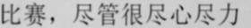
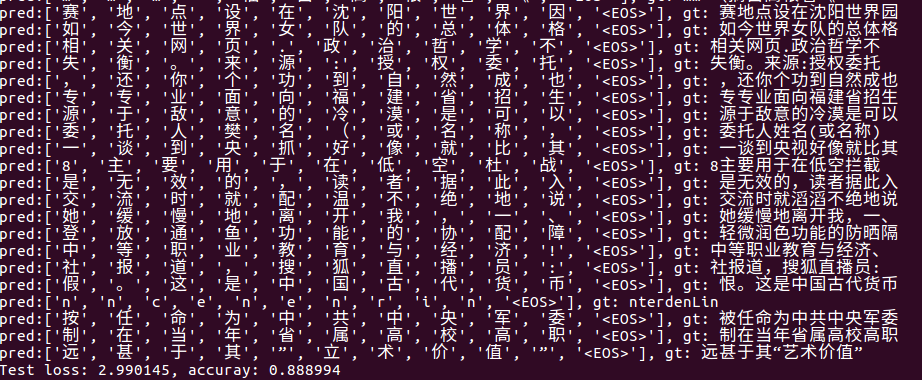
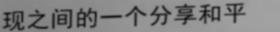
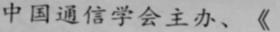
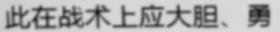
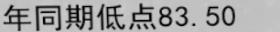
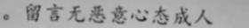
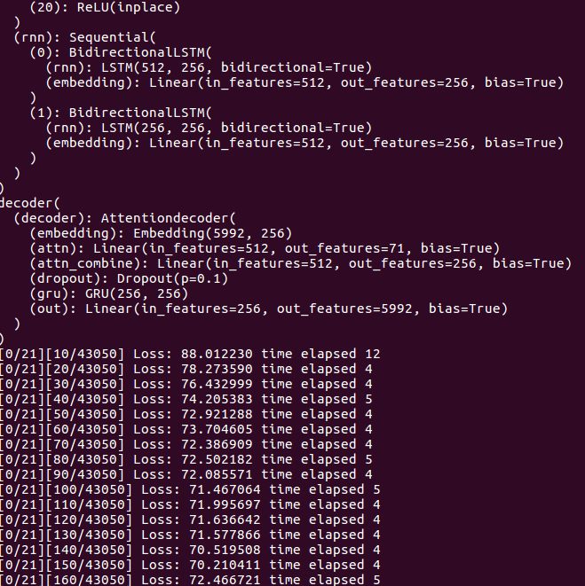

attention-ocr.pytorch:Encoder+Decoder+attention model
======================================

This repository implements the the encoder and decoder model with attention model for OCR, and this repository is modified from https://github.com/meijieru/crnn.pytorch  
There are many attention ocr repository which is finished with tensorflow, but they don't give the **inference.py**, besides i'm not good at tensorflow, i can't finish the **inference.py** by myself  

# requirements
pytorch 0.4.1  
opencv_python
```bash
cd Attention_ocr.pytorch
pip install -r requirements.txt
```

# Test
1. download the pretrained model from [attentioncnn.zip](https://pan.baidu.com/s/1h5d7rtWqfZaKHtm52ZWVFw) ,and put the pth files into the folder:expr/attentioncnn/  

2. change the test image's name in **demo.py**,the test images are in the test_img folder
```bash
python demo.py
```
3. results  

```
>>>predict_str:比赛，尽管很尽心尽力           => prob:0.6112725138664246
```
4. some examples


| picture | predict reading | confidence |
| ------ | ------ | ------ |
|  | 美国人不愿意与制鲜 | 0.33920 |
|  | 现之间的一个分享和 | 0.81095 |
|  | 中国通信学会主办、《 | 0.90660 |
|  | 此在战术上应大胆、勇 | 0.57111 |
|  | 年同期俱点83.50 | 0.14481 |
|  | 。留言无恶意心态成 | 0.31054 |

5. the accuracy in the test data just stay around 88%, there is much thing to do
# Train 
1. Here i choose a small dataset from [Synthetic_Chinese_String_Dataset](https://github.com/chenjun2hao/caffe_ocr), about 270000+ images for training, 20000 images for testing.
download the image data from [Baidu](https://pan.baidu.com/s/1hIurFJ73XbzL-QG4V-oe0w)
2. the train_list.txt and test_list.txt are created as the follow form:
```
# path/to/image_name.jpg label
path/AttentionData/50843500_2726670787.jpg 情笼罩在他们满是沧桑
path/AttentionData/57724421_3902051606.jpg 心态的松弛决定了比赛
path/AttentionData/52041437_3766953320.jpg 虾的鲜美自是不可待言
```
3. change the **trainlist** and **vallist** parameter in train.py, and start train
```bash
cd Attention_ocr.pytorch
python train.py --trainlist ./data/ch_train.txt --vallist ./data/ch_test.txt
```
then you can see in the terminel as follow:


# Reference
1. [crnn.pytorch](https://github.com/meijieru/crnn.pytorch)
2. [Attention-OCR](https://github.com/da03/Attention-OCR)
3. [Seq2Seq-PyTorch](https://github.com/MaximumEntropy/Seq2Seq-PyTorch)
4. [caffe_ocr](https://github.com/senlinuc/caffe_ocr)

# TO DO
- [ ] change LSTM to Conv1D, it can greatly accelerate the inference
- [ ] to support images of different widths
- [ ] change the cnn bone model with inception net, densenet
